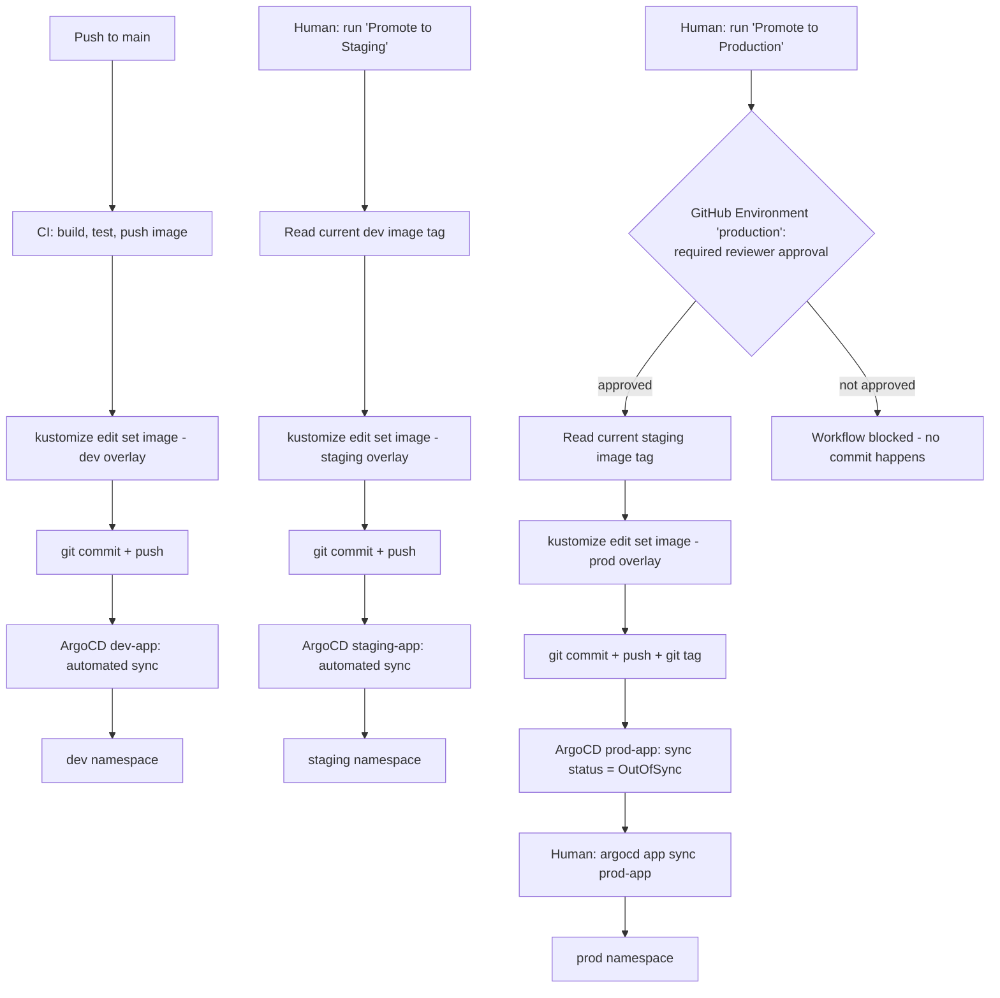

# Architecture

## Why two separate gates before prod

**Gate 1 — GitHub Environment required reviewer** (before the Git commit
happens): stops the *intent* to promote from even reaching version control
without sign-off. This is the "should we ship this" decision.

**Gate 2 — ArgoCD manual sync** (before the commit is actually applied to
the cluster): stops the *deployment* from happening automatically even after
it's been approved and committed. This is the "is now actually a safe
moment to deploy" decision — useful if, say, an approved promotion sits
overnight and someone wants to double check nothing else changed before
clicking Sync the next morning.

Two gates instead of one is a deliberate defense-in-depth choice, not
redundancy for its own sake — see `docs/INTERVIEW_TALKING_POINTS.md` for the
tradeoffs.

## Why dev has zero gates

Dev is meant to be disposable and fast — the whole point of having a dev
environment is to see your change running quickly. Adding any approval step
here just slows down the feedback loop without protecting anything
important; nothing depends on dev being stable.
